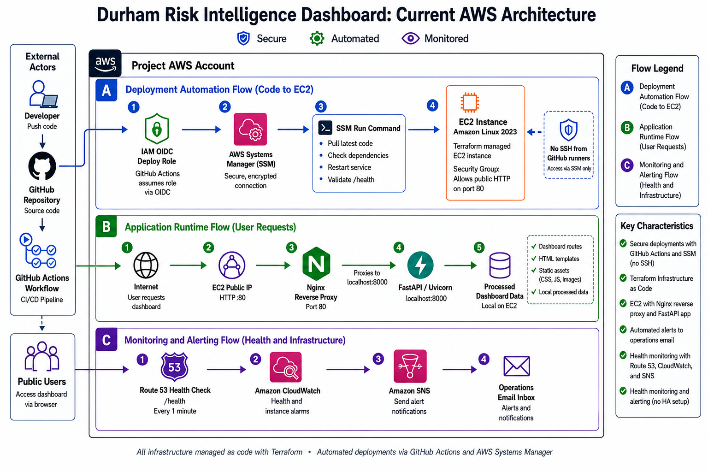
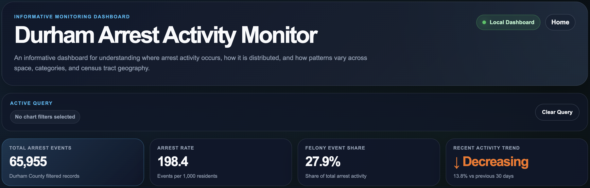
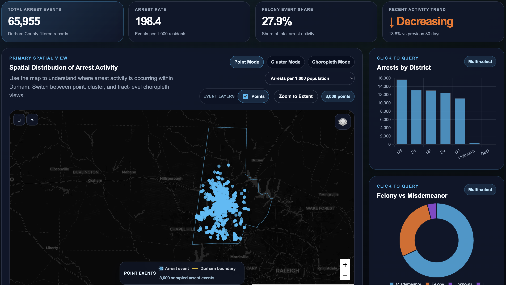
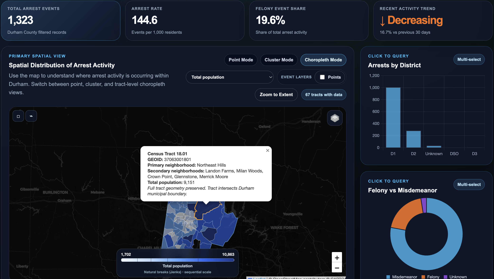
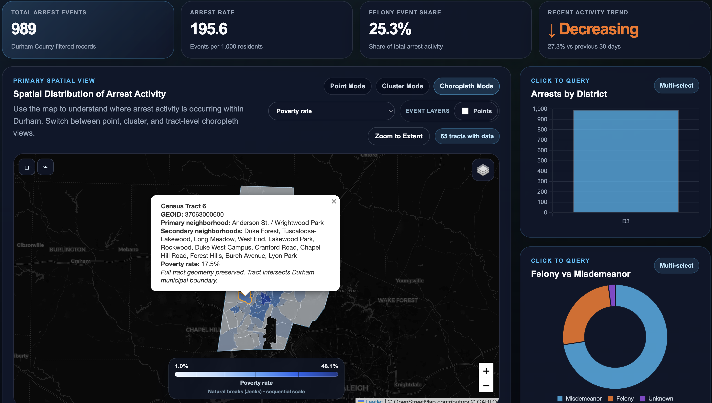
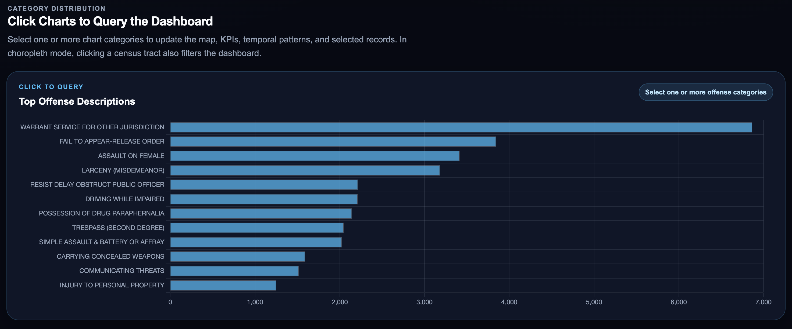

# Durham Risk Intelligence Dashboard

The Durham Risk Intelligence Dashboard is a cloud deployed geospatial analytics application for exploring Durham public safety event data through interactive maps, KPI summaries, and analytical visualizations.

The project demonstrates how a local FastAPI dashboard can be matured into a production style AWS deployment using Terraform, Nginx, CloudWatch, SNS, Route 53 health checks, GitHub Actions, OIDC, and AWS Systems Manager.

It is designed as a portfolio project that connects geospatial intelligence, public safety analytics, cloud infrastructure, and deployment automation.

## Project Evolution

This project was developed in stages to demonstrate the progression from a local analytical prototype to a cloud hosted, monitored, and automated deployment.

```text
Local FastAPI dashboard
  -> EC2 deployment
  -> Persistent systemd service
  -> Nginx reverse proxy
  -> Terraform managed infrastructure
  -> CloudWatch and SNS monitoring
  -> Route 53 application health checks
  -> GitHub Actions deployment automation with OIDC and SSM
```

Earlier AWS architecture experiments, including ALB, Target Group, Custom AMI, Launch Template, and Auto Scaling Group work, are preserved in `docs/` as learning and exploration notes. They are not the current final deployment path.

## Current Architecture

The current portfolio architecture is a Terraform managed single-instance AWS deployment.

Public traffic enters through Nginx on standard HTTP port `80`. The FastAPI application runs internally on localhost port `8000` and is managed by `systemd`.

### Final AWS Architecture



[Open high resolution architecture diagram](./artifacts/diagrams/final_aws_architecture_highres.png)

Runtime path:

```text
User browser
  -> EC2 public IP on HTTP port 80
  -> Nginx reverse proxy
  -> FastAPI app on localhost port 8000
  -> dashboard routes, templates, static files, and local project data
```

Current public endpoints:

```text
Dashboard: http://54.242.183.123
Health:    http://54.242.183.123/health
```

Confirmed runtime details:

| Item | Value |
|---|---|
| EC2 instance ID | `i-0998e40b915d53346` |
| Public HTTP port | `80` |
| Internal FastAPI port | `8000` |
| Service name | `durham-risk-dashboard.service` |
| EC2 deploy path | `/home/ec2-user/durham-aws-risk-dashboard` |
| AWS region | `us-east-1` |

## Dashboard Capabilities

The dashboard MVP is feature frozen at the Git tag:

```text
dashboard-mvp-v1
```

The dashboard is intended for public-facing spatial analysis, monitoring, preparedness, and resilience interpretation. It is not an enforcement prediction tool.

Core dashboard capabilities include:

- Interactive Leaflet map with point, cluster, density, and choropleth visualization modes.
- Durham municipal boundary and census tracts intersecting the municipal boundary.
- Full census tract geometries preserved for ACS and tract-level analytical consistency.
- Tract-level enrichment outputs combining ACS demographic indicators and event aggregates.
- Separate enriched arrest and shooting event outputs.
- Neighborhood context geography for public interpretation and local orientation.
- KPI cards, district and severity charts, top offense summaries, selected records, and a Temporal Activity Explorer.
- Start date and end date filtering intended to update the full dashboard.
- Refined tract popup behavior, choropleth legends, selected-feature highlighting, and spatial filtering interactions.

## Machine Learning Extension

The project now includes an offline ML extension for tract-level elevated arrest activity modeling. The ML layer is arrest-focused, does not use shooting data, does not predict individual behavior, and is not crime prediction. It is intended for tract-level analytical interpretation, contextual indicators, decision-support interpretation, and portfolio demonstration.

The initial target is:

```text
elevated_arrest_activity_flag
```

Target definition:

- `1` = census tract in the top 25% by arrests per 1,000 residents.
- `0` = all other census tracts.

Phase 1 includes a logistic regression baseline, a random forest comparison model, and repeated stratified cross-validation. Repeated stratified cross-validation supported logistic regression as the preferred explainable baseline, while random forest remained useful as a nonlinear comparison model.

Direct arrest-rate, raw arrest-count, identifier, and text/categorical columns were excluded from modeling features to reduce leakage.

### Spatial Autocorrelation Analysis

The project also includes an offline spatial statistical analysis using Global Moran's I and Local Moran's I / LISA to evaluate whether tract-level arrest activity is spatially clustered across neighboring census tracts.

The analysis uses all Durham census tracts in the enriched tract GeoJSON and uses `arrests_per_1000_population` as the analysis variable. Global Moran's I was `0.2443` with a permutation p-value of `0.001`, indicating statistically significant positive spatial autocorrelation in tract-level arrest rates.

At `p <= 0.05`, Local Moran's I / LISA identified:

- High-High: 6
- Low-Low: 4
- High-Low: 1
- Not significant: 57

This complements the ML models by evaluating geographic clustering of observed arrest rates rather than classifying elevated activity from contextual indicators. It is exploratory and should not be interpreted as an individual-level risk model or operational enforcement tool.

Spatial autocorrelation resources:

- [Spatial Autocorrelation Notes](docs/ml_spatial_autocorrelation_notes.md)
- `ml/scripts/run_morans_i_hotspot_analysis.py`
- `ml/outputs/morans_i_global_summary.json`
- `ml/outputs/local_morans_i_static_map.png`

ML documentation:

- [ML Phase 1 Plan](docs/ml_phase_1_plan.md)
- [Model Card](docs/ml_model_card.md)
- [Model Comparison](docs/ml_model_comparison.md)

ML artifacts:

- `ml/scripts/build_ml_dataset.py`
- `ml/scripts/train_logistic_regression.py`
- `ml/scripts/train_random_forest.py`
- `ml/scripts/evaluate_models_cross_validation.py`
- `ml/notebooks/01_logistic_regression_exploration.ipynb`

## Data Sources

This project uses publicly available public safety, geographic, and census-based datasets to support spatial analysis and dashboard visualization.

Primary data sources include:

- Durham public safety event data used for arrest and shooting event analysis.
- Durham municipal boundary and operational geography used for map context.
- U.S. Census tract geography used as the primary analytical geography.
- American Community Survey data used for tract-level demographic and contextual enrichment.
- Durham neighborhood context geography from the `PhillipBost/durham-hoods-geojson` GitHub repository, which provides Durham, North Carolina neighborhood boundaries in GeoJSON format.

Neighborhood source:

- `PhillipBost/durham-hoods-geojson`: https://github.com/PhillipBost/durham-hoods-geojson

The dashboard is intended for public-facing spatial analysis, preparedness, and decision intelligence. It is not designed as an enforcement prediction tool.

## Infrastructure as Code

Terraform in `infra/terraform/` manages the current AWS infrastructure foundation.

Terraform currently manages:

- EC2 instance.
- Security group.
- IAM roles and instance profile for SSM.
- GitHub Actions OIDC deploy role.
- SNS topic.
- CloudWatch alarms.
- Route 53 application health check.
- Terraform outputs for public URL, instance details, and internal app port.

The EC2 instance is configured through a bootstrap script connected to Terraform `user_data`:

```text
infra/scripts/ec2_bootstrap.sh
```

The bootstrap process installs system dependencies, clones the repository, creates the Python virtual environment, installs `requirements.txt`, creates the `systemd` service, configures Nginx, and starts both services.

The security group allows public HTTP traffic on port `80`. Public inbound access to FastAPI port `8000` has been removed; port `8000` remains an internal application runtime port behind Nginx.

## Deployment Automation

Deployment is automated with GitHub Actions:

```text
.github/workflows/deploy.yml
```

Deployment flow:

```text
Developer pushes to main
  -> GitHub Actions starts
  -> GitHub OIDC assumes AWS IAM deploy role
  -> GitHub Actions sends AWS SSM command
  -> EC2 pulls latest code
  -> Python requirements are checked
  -> systemd restarts durham-risk-dashboard.service
  -> local /health endpoint is validated
```

GitHub Actions does not SSH into EC2, and no SSH access was opened for GitHub hosted runners. The workflow uses GitHub OIDC instead of long-lived AWS access keys in GitHub.

GitHub Actions deploy role:

```text
arn:aws:iam::333973504198:role/durham-risk-dashboard-dev-github-actions-deploy-role
```

This deployment path demonstrates CI/CD fundamentals, identity federation, IAM role design, AWS Systems Manager command execution, and service-level health validation.

## Monitoring and Alerting

The deployment monitors both infrastructure health and application health.

Infrastructure monitoring:

- EC2 CPU utilization CloudWatch alarm.
- EC2 status check failure CloudWatch alarm.

Application monitoring:

- Route 53 HTTP health check against `http://54.242.183.123/health`.
- CloudWatch alarm on the Route 53 `HealthCheckStatus` metric.
- SNS email alert path through the dashboard alerts topic.

The Route 53 health check reaches the application through the public Nginx endpoint on port `80`. FastAPI remains internal on port `8000`.

## Screenshots

### Dashboard Summary and KPI View



### Dashboard Overview



### Choropleth Analysis View



### Additional Spatial Analysis View



### Dashboard Analytics View



## Repository Structure

```text
durham-aws-risk-dashboard/
  app/
    main.py
    templates/
    static/
      css/
      js/
      geojson/
  data/
    processed/
    raw_geo/
  docs/
    current_architecture_diagram.md
    dashboard_mvp_summary.md
    process_log.md
    ...
  infra/
    scripts/
      ec2_bootstrap.sh
    terraform/
      main.tf
      variables.tf
      outputs.tf
      README.md
      terraform.tfvars.example
  scripts/
    build_event_tract_enrichment.py
    build_neighborhood_context.py
    build_tract_join.py
    extract_durham_acs_tracts.py
  .github/
    workflows/
      deploy.yml
  requirements.txt
  README.md
```

## Technical Skills Demonstrated

- FastAPI application development.
- Geospatial dashboard development with Leaflet.
- Analytical visualization with Chart.js.
- Census/ACS enrichment and tract-level geospatial processing.
- AWS EC2 application hosting.
- Nginx reverse proxy configuration.
- Linux service management with `systemd`.
- Terraform infrastructure management.
- IAM role design for EC2, SSM, and GitHub OIDC.
- AWS Systems Manager command execution.
- GitHub Actions deployment automation.
- CloudWatch alarms, SNS alerting, and Route 53 health checks.
- Security group hardening and public/private runtime separation.

## Current Limitations

This is a portfolio ready, single instance deployment, not a multiple AZ production system.

Current limitations:

- No HTTPS certificate or custom domain yet.
- No Route 53 DNS record for a named dashboard URL yet.
- No CloudWatch log forwarding yet.
- No managed database layer; the dashboard uses local project data files.
- No blue/green or rolling deployment strategy.
- No multi-instance load balancing in the current final deployment.

## Future Improvements

Potential future improvements include:

- Add HTTPS with a managed certificate.
- Add a Route 53 DNS record for a stable dashboard domain.
- Add CloudWatch log forwarding for application and Nginx logs.
- Add deployment notifications for GitHub Actions runs.
- Add broader automated test gates before deployment.
- Explore AMI baking or a more formal release process.
- Evaluate whether a future ALB or multi-instance design is needed for a later production-style version.

## Documentation

Supporting documentation is stored in the `docs/` folder.

| Document | Purpose |
|---|---|
| `docs/current_architecture_diagram.md` | Final current AWS architecture diagram and deployment flow |
| `docs/dashboard_mvp_summary.md` | Dashboard MVP technical summary and Phase 6 operations update |
| `docs/process_log.md` | Chronological project build and milestone log |
| `infra/terraform/README.md` | Terraform workspace documentation |
| `docs/aws_architecture_notes.md` | Earlier AWS architecture notes and exploratory work |
| `docs/alb_target_group_notes.md` | Earlier ALB and Target Group exploration notes |
| `docs/auto_scaling_group_notes.md` | Earlier Auto Scaling Group exploration notes |

## Portfolio Narrative

This project shows the full path from a local geospatial dashboard to a cloud hosted AWS application with automated deployment and monitoring.

It combines FastAPI, EC2, Nginx, Terraform, GitHub Actions, AWS Systems Manager, CloudWatch/SNS alerting, and Route 53 health checks into one practical cloud engineering portfolio project.
