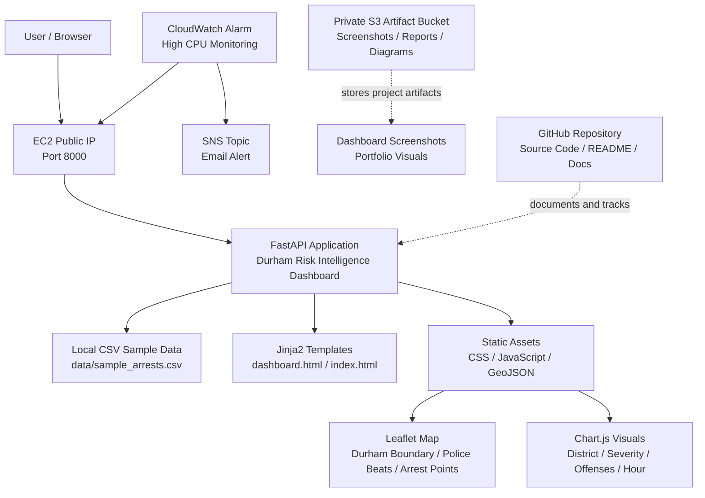

# Current AWS Architecture Diagram

## Durham Risk Intelligence Dashboard



## Current Architecture Summary

The current implementation is an early Phase 1 AWS deployment.

The dashboard runs on a single Ubuntu EC2 instance and is served through a persistent `systemd` service. Public access is currently available through the EC2 public IP on port `8000`. The application reads a local CSV sample dataset and serves a FastAPI based dashboard with templates, static assets, Leaflet mapping, Chart.js analytics, and GeoJSON overlays.

CloudWatch and SNS provide basic monitoring and alerting. A private S3 bucket stores project artifacts such as screenshots, reports, and future architecture diagrams. GitHub stores the source code, documentation, and deployment notes.

## Current Request Flow

```text
User
  ↓
EC2 Public IP on port 8000
  ↓
FastAPI dashboard application
  ↓
Local sample arrest dataset
  ↓
Rendered dashboard, API responses, map layers, and charts
```

## Current Supporting Services

| Component | Purpose |
|---|---|
| EC2 | Hosts the FastAPI dashboard |
| systemd | Keeps the application running persistently |
| Security Group | Restricts SSH and dashboard access |
| CloudWatch | Monitors EC2 CPU usage |
| SNS | Sends alert notifications |
| S3 | Stores private project artifacts |
| GitHub | Stores project source code and documentation |

## Current Limitations

The current architecture is functional but not yet production style.

Current limitations include:

- Direct public access to EC2 on port `8000`
- No Application Load Balancer yet
- No Auto Scaling Group yet
- No custom VPC with public and private subnet separation yet
- No RDS or managed database layer yet
- Manual deployment process
- Infrastructure is not yet managed with Terraform
- CI/CD pipeline has not been added yet

## Next Target Architecture Direction

The next major AWS architecture improvement is to place the application behind an Application Load Balancer.

The longer term target is:

```text
User
  ↓
Application Load Balancer
  ↓
EC2 application instances
  ↓
Private data layer or structured storage
  ↓
S3 artifacts, monitoring, Terraform, and CI/CD
```
