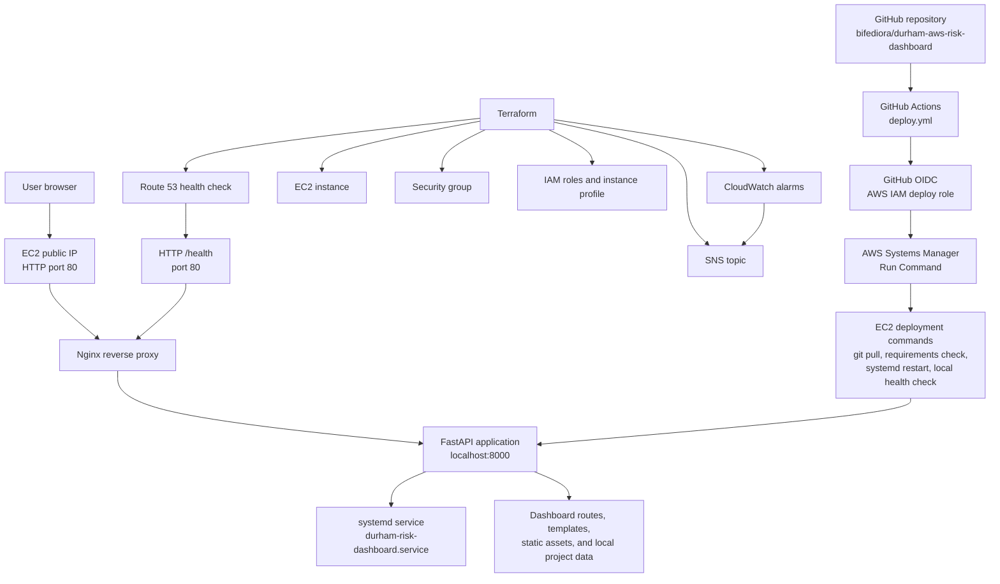

# Final AWS Architecture

## Project

Durham Risk Intelligence Dashboard

## Current Architecture Summary

The Durham Risk Intelligence Dashboard is deployed as a Terraform managed FastAPI application on AWS.

The current architecture uses a single Amazon Linux 2023 EC2 instance, Nginx as the public reverse proxy, a FastAPI application running internally on port `8000`, and a persistent `systemd` service to keep the dashboard running.

Application deployment is automated through GitHub Actions using GitHub OIDC, AWS IAM, and AWS Systems Manager. GitHub Actions does not SSH into the EC2 instance, and no SSH access was opened for GitHub hosted runners.

Monitoring includes EC2 level CloudWatch alarms, SNS email alerting, and a Route 53 HTTP health check that monitors the public `/health` endpoint through port `80`.

## Architecture Diagram



## Public Runtime Path

```text
User browser
  ↓
EC2 public IP on HTTP port 80
  ↓
Nginx reverse proxy
  ↓
FastAPI application on localhost port 8000
  ↓
Dashboard routes, templates, static assets, and local project data
```

## Deployment Automation Path

```text
Push to main
  ↓
GitHub Actions starts
  ↓
GitHub OIDC assumes the Terraform managed AWS IAM deploy role
  ↓
GitHub Actions sends an AWS Systems Manager command to EC2
  ↓
EC2 pulls latest code from GitHub
  ↓
Python requirements are checked
  ↓
systemd restarts durham-risk-dashboard.service
  ↓
Local http://localhost:8000/health check passes
```

## Monitoring Path

```text
Route 53 HTTP health check
  ↓
Public /health endpoint on port 80
  ↓
Nginx reverse proxy
  ↓
FastAPI /health route on localhost:8000
  ↓
CloudWatch HealthCheckStatus alarm
  ↓
SNS email alert path
```

## Current Supporting Services

| Component | Purpose |
|---|---|
| EC2 | Hosts the FastAPI dashboard application |
| Nginx | Public reverse proxy on HTTP port `80` |
| FastAPI | Internal dashboard application runtime on port `8000` |
| systemd | Keeps the dashboard service running persistently |
| Terraform | Manages infrastructure resources and IAM configuration |
| Security Group | Allows public HTTP on port `80` and restricts direct app port access |
| GitHub Actions | Automates deployment on push to `main` and manual workflow dispatch |
| GitHub OIDC | Allows GitHub Actions to assume AWS IAM role without long-lived AWS keys |
| AWS Systems Manager | Executes deployment commands on EC2 without GitHub runner SSH |
| CloudWatch | Monitors EC2 and application health metrics |
| Route 53 Health Check | Checks the public `/health` endpoint over HTTP on port `80` |
| SNS | Sends monitoring alert notifications |

## Current Security Posture

- Public dashboard traffic enters through Nginx on port `80`.
- FastAPI runs internally on port `8000`.
- Public access to FastAPI port `8000` is closed in the Terraform managed security group.
- GitHub Actions deployment does not use SSH.
- No SSH access was opened for GitHub hosted runners.
- GitHub OIDC is used instead of long-lived AWS access keys in GitHub.

## Current Limitations and Next Improvements

The current architecture is a portfolio-ready single-instance deployment, not a multi-AZ production architecture.

Potential future improvements include:

- HTTPS and domain setup.
- Route 53 DNS record for a named dashboard URL.
- CloudWatch log forwarding.
- Deployment notifications.
- Broader workflow test gates.
- Optional AMI baking or a more formal release process.
