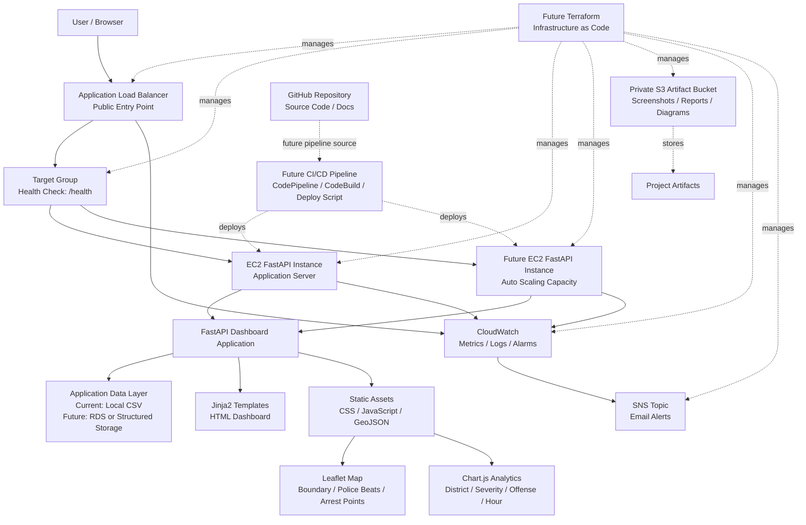

# Target AWS Architecture Diagram

## Durham Risk Intelligence Dashboard

## Purpose

This document describes the target Phase 1 production style AWS architecture for the Durham Risk Intelligence Dashboard.

The current implementation runs on a single EC2 instance with direct public access on port `8000`. The target architecture moves the application toward a more production style pattern using an Application Load Balancer, target group health checks, EC2 application instances, controlled networking, monitoring, and future scaling.

This target architecture is intended to support the broader three phase cloud portfolio plan:

1. Build a production style AWS architecture
2. Convert the infrastructure to Terraform
3. Add CI/CD deployment automation

## Target Architecture Diagram



## Target Request Flow

```text
User
  ↓
Application Load Balancer
  ↓
Target Group
  ↓
Healthy EC2 FastAPI application instance
  ↓
FastAPI dashboard routes and API endpoints
  ↓
Application data layer
  ↓
Rendered dashboard, map layers, charts, and JSON responses
```

## Target AWS Services

| AWS Service | Target Role |
|---|---|
| VPC | Provides an isolated network boundary for the application |
| Public Subnets | Host internet facing resources such as the Application Load Balancer |
| Private Subnets | Host application instances and future private data resources |
| Internet Gateway | Allows public internet access to the load balancer |
| NAT Gateway | Allows private instances to reach the internet for updates and dependency installation |
| EC2 | Runs the FastAPI application workload |
| Target Group | Registers EC2 instances and performs health checks |
| Application Load Balancer | Routes public HTTP traffic to healthy application instances |
| Auto Scaling Group | Maintains desired application capacity and supports instance replacement |
| S3 | Stores private project artifacts, reports, screenshots, and diagrams |
| CloudWatch | Collects metrics, logs, and alarms |
| SNS | Sends operational alert notifications |
| IAM | Controls permissions for AWS resources and services |
| RDS | Future private managed database layer if the project moves beyond local CSV data |
| CodePipeline | Future CI/CD orchestration service |
| CodeBuild | Future build and deployment automation service |
| Terraform | Future Infrastructure as Code tool for repeatable AWS provisioning |

## Target Network Layout

The long term target architecture should move toward a custom VPC with public and private subnet separation.

Recommended layout:

```text
VPC
  Public Subnet A
    Application Load Balancer

  Public Subnet B
    Application Load Balancer

  Private Subnet A
    EC2 FastAPI application instance

  Private Subnet B
    Future EC2 FastAPI application instance

  Future Private Data Subnet A
    RDS or structured data layer

  Future Private Data Subnet B
    RDS standby or multi Availability Zone database resource
```

## Current Versus Target Access Pattern

Current access pattern:

```text
User
  ↓
EC2 public IP on port 8000
  ↓
FastAPI application
```

Target access pattern:

```text
User
  ↓
Application Load Balancer
  ↓
Target group health check
  ↓
EC2 application instance
  ↓
FastAPI application
```

The target pattern is better because it introduces:

- A stable public entry point
- Health check based routing
- A foundation for multiple instances
- A cleaner separation between public access and application compute
- A pathway toward Auto Scaling
- A better architecture story for Terraform and CI/CD

## Application Load Balancer Role

The Application Load Balancer should become the public entry point for the dashboard.

Target ALB responsibilities:

- Accept public HTTP traffic
- Route requests to healthy EC2 targets
- Use `/health` as the health check endpoint
- Prepare the application for multiple backend instances
- Reduce reliance on direct public EC2 access
- Support future HTTPS configuration with a certificate

Initial target listener:

```text
HTTP :80
```

Future listener:

```text
HTTPS :443
```

Recommended health check path:

```text
/health
```

Expected health check response:

```json
{
  "status": "healthy",
  "service": "Durham Risk Intelligence Dashboard",
  "version": "0.2.3"
}
```

## Target Group Role

The target group should register one or more EC2 application instances.

Target group responsibilities:

- Track registered EC2 instances
- Send health checks to `/health`
- Route traffic only to healthy targets
- Support future Auto Scaling integration

Initial target group configuration:

```text
Target type: Instance
Protocol: HTTP
Port: 8000
Health check path: /health
```

## EC2 Role in Target Architecture

In the target architecture, EC2 remains the application compute layer.

Current EC2 role:

- Runs the FastAPI dashboard
- Serves the app on port `8000`
- Uses a Python virtual environment
- Runs through a persistent `systemd` service
- Reads the local sample CSV dataset

Future EC2 role:

- Sit behind an Application Load Balancer
- Receive traffic from the target group
- Avoid direct public user access where possible
- Use a launch template
- Join an Auto Scaling Group
- Pull deployment updates through a CI/CD process

## Security Group Direction

Current security group pattern:

| Port | Purpose | Source |
|---|---|---|
| 22 | SSH access | Current user IP |
| 8000 | Dashboard access | Current user IP |

Target security group pattern:

| Resource | Port | Source |
|---|---|---|
| Application Load Balancer | 80 | Public internet |
| Application Load Balancer | 443 | Public internet in future |
| EC2 application instance | 8000 | Application Load Balancer security group |
| EC2 application instance | 22 | Current user IP or controlled admin access |

The key future improvement is to stop exposing EC2 port `8000` directly to users and allow port `8000` only from the Application Load Balancer security group.

## S3 Role in Target Architecture

S3 currently stores private project artifacts.

Current S3 use:

- Dashboard screenshots
- Reports
- Diagrams
- Documentation artifacts

Future S3 use may include:

- Exported dashboard reports
- Architecture diagrams
- Deployment artifacts
- Static project outputs
- Terraform state if configured carefully with locking and encryption later

Current bucket:

```text
durham-risk-dashboard-artifacts-byron-333973504198-us-east-1-an
```

The bucket should remain private unless a specific public sharing strategy is intentionally added later.

## CloudWatch and SNS Role in Target Architecture

CloudWatch and SNS should continue to provide operational monitoring.

Current monitoring:

- CloudWatch CPU alarm
- SNS email alert topic

Target monitoring additions:

- ALB target health monitoring
- EC2 status check alarms
- Application level logs
- Uvicorn or systemd log monitoring
- Error rate monitoring
- Latency monitoring through ALB metrics
- Alarm notifications through SNS

Current SNS topic:

```text
durham-risk-dashboard-alerts
```

Current CloudWatch alarm:

```text
durham-risk-dashboard-high-cpu
```

## Future Auto Scaling Role

Auto Scaling is not currently implemented.

The future Auto Scaling Group should:

- Maintain at least one healthy EC2 application instance
- Replace unhealthy instances automatically
- Integrate with the target group
- Use a launch template
- Support horizontal scaling if load increases
- Provide a stronger production style architecture pattern

Initial Auto Scaling target:

```text
Minimum capacity: 1
Desired capacity: 1
Maximum capacity: 2
```

This keeps the project cost controlled while demonstrating architecture readiness.

## Future Data Layer Direction

The current application reads:

```text
data/sample_arrests.csv
```

This is acceptable for the current stage because the project focus is AWS architecture, not database engineering.

Future data layer options:

1. Continue using local CSV for simple demonstration
2. Store structured input data in S3
3. Move application data into RDS
4. Use RDS only after the core AWS architecture is stable
5. Avoid overbuilding the data layer before ALB, Auto Scaling, Terraform, and CI/CD are in place

Recommended next data direction:

```text
Keep local CSV for now.
Do not add RDS until the load balancer, target group, and Auto Scaling foundation are complete.
```

## Future Terraform Direction

Terraform should eventually manage the target architecture.

Future Terraform managed resources:

- VPC
- Public subnets
- Private subnets
- Internet Gateway
- NAT Gateway or lower cost alternative
- Route tables
- Security groups
- EC2 launch template
- Application Load Balancer
- Target group
- Auto Scaling Group
- S3 bucket
- CloudWatch alarms
- SNS topic
- IAM roles and policies

Terraform should be added after the manual AWS architecture is understood and working.

## Future CI/CD Direction

CI/CD should eventually automate deployment from GitHub.

Future CI/CD flow:

```text
GitHub
  ↓
CodePipeline
  ↓
CodeBuild
  ↓
Deployment step
  ↓
EC2 application instance or Auto Scaling Group
  ↓
Health check validation
```

Target CI/CD goals:

- Pull code from GitHub
- Install dependencies
- Deploy updated application files
- Restart the systemd service
- Validate `/health`
- Reduce manual `scp` deployments
- Support safer and repeatable deployment workflows

## Target Architecture Build Sequence

Recommended build sequence from the current state:

1. Create target architecture diagram
2. Add Application Load Balancer
3. Create target group
4. Configure target group health check using `/health`
5. Register the current EC2 instance as a target
6. Confirm dashboard works through the ALB DNS name
7. Adjust security groups so users access the ALB instead of EC2 port `8000`
8. Document ALB setup
9. Update README and architecture notes
10. Add launch template
11. Add Auto Scaling Group
12. Prepare Terraform structure
13. Recreate architecture with Terraform
14. Add CI/CD pipeline

## Cost Control Notes

The target architecture should be built carefully to avoid unnecessary cost.

Cost control guidance:

- Keep EC2 capacity small
- Use only one running application instance initially
- Delay RDS until needed
- Delay NAT Gateway unless required, because NAT Gateway can add cost
- Keep S3 private and minimal
- Keep Auto Scaling maximum capacity low
- Watch CloudWatch billing and alarms
- Continue using the AWS budget alert already created

## Target Architecture Summary

The target architecture moves the project from a single instance EC2 deployment to a more production style AWS pattern.

The next major transition is:

```text
From:
User → EC2 public IP → FastAPI

To:
User → Application Load Balancer → Target Group → EC2 FastAPI instance
```

This transition supports the original Phase 1 goal and prepares the project for Auto Scaling, Terraform, and CI/CD.

EOFcd /Users/byron/Documents/Projects/durham-aws-risk-dashboard

cat > docs/target_architecture_diagram.md <<'EOF'
# Target AWS Architecture Diagram

## Durham Risk Intelligence Dashboard

## Purpose

This document describes the target Phase 1 production style AWS architecture for the Durham Risk Intelligence Dashboard.

The current implementation runs on a single EC2 instance with direct public access on port `8000`. The target architecture moves the application toward a more production style pattern using an Application Load Balancer, target group health checks, EC2 application instances, controlled networking, monitoring, and future scaling.

This target architecture is intended to support the broader three phase cloud portfolio plan:

1. Build a production style AWS architecture
2. Convert the infrastructure to Terraform
3. Add CI/CD deployment automation

## Target Architecture Diagram


## Target Request Flow

```text
User
  ↓
Application Load Balancer
  ↓
Target Group
  ↓
Healthy EC2 FastAPI application instance
  ↓
FastAPI dashboard routes and API endpoints
  ↓
Application data layer
  ↓
Rendered dashboard, map layers, charts, and JSON responses
```

## Target AWS Services

| AWS Service | Target Role |
|---|---|
| VPC | Provides an isolated network boundary for the application |
| Public Subnets | Host internet facing resources such as the Application Load Balancer |
| Private Subnets | Host application instances and future private data resources |
| Internet Gateway | Allows public internet access to the load balancer |
| NAT Gateway | Allows private instances to reach the internet for updates and dependency installation |
| EC2 | Runs the FastAPI application workload |
| Target Group | Registers EC2 instances and performs health checks |
| Application Load Balancer | Routes public HTTP traffic to healthy application instances |
| Auto Scaling Group | Maintains desired application capacity and supports instance replacement |
| S3 | Stores private project artifacts, reports, screenshots, and diagrams |
| CloudWatch | Collects metrics, logs, and alarms |
| SNS | Sends operational alert notifications |
| IAM | Controls permissions for AWS resources and services |
| RDS | Future private managed database layer if the project moves beyond local CSV data |
| CodePipeline | Future CI/CD orchestration service |
| CodeBuild | Future build and deployment automation service |
| Terraform | Future Infrastructure as Code tool for repeatable AWS provisioning |

## Target Network Layout

The long term target architecture should move toward a custom VPC with public and private subnet separation.

Recommended layout:

```text
VPC
  Public Subnet A
    Application Load Balancer

  Public Subnet B
    Application Load Balancer

  Private Subnet A
    EC2 FastAPI application instance

  Private Subnet B
    Future EC2 FastAPI application instance

  Future Private Data Subnet A
    RDS or structured data layer

  Future Private Data Subnet B
    RDS standby or multi Availability Zone database resource
```

## Current Versus Target Access Pattern

Current access pattern:

```text
User
  ↓
EC2 public IP on port 8000
  ↓
FastAPI application
```

Target access pattern:

```text
User
  ↓
Application Load Balancer
  ↓
Target group health check
  ↓
EC2 application instance
  ↓
FastAPI application
```

The target pattern is better because it introduces:

- A stable public entry point
- Health check based routing
- A foundation for multiple instances
- A cleaner separation between public access and application compute
- A pathway toward Auto Scaling
- A better architecture story for Terraform and CI/CD

## Application Load Balancer Role

The Application Load Balancer should become the public entry point for the dashboard.

Target ALB responsibilities:

- Accept public HTTP traffic
- Route requests to healthy EC2 targets
- Use `/health` as the health check endpoint
- Prepare the application for multiple backend instances
- Reduce reliance on direct public EC2 access
- Support future HTTPS configuration with a certificate

Initial target listener:

```text
HTTP :80
```

Future listener:

```text
HTTPS :443
```

Recommended health check path:

```text
/health
```

Expected health check response:

```json
{
  "status": "healthy",
  "service": "Durham Risk Intelligence Dashboard",
  "version": "0.2.3"
}
```

## Target Group Role

The target group should register one or more EC2 application instances.

Target group responsibilities:

- Track registered EC2 instances
- Send health checks to `/health`
- Route traffic only to healthy targets
- Support future Auto Scaling integration

Initial target group configuration:

```text
Target type: Instance
Protocol: HTTP
Port: 8000
Health check path: /health
```

## EC2 Role in Target Architecture

In the target architecture, EC2 remains the application compute layer.

Current EC2 role:

- Runs the FastAPI dashboard
- Serves the app on port `8000`
- Uses a Python virtual environment
- Runs through a persistent `systemd` service
- Reads the local sample CSV dataset

Future EC2 role:

- Sit behind an Application Load Balancer
- Receive traffic from the target group
- Avoid direct public user access where possible
- Use a launch template
- Join an Auto Scaling Group
- Pull deployment updates through a CI/CD process

## Security Group Direction

Current security group pattern:

| Port | Purpose | Source |
|---|---|---|
| 22 | SSH access | Current user IP |
| 8000 | Dashboard access | Current user IP |

Target security group pattern:

| Resource | Port | Source |
|---|---|---|
| Application Load Balancer | 80 | Public internet |
| Application Load Balancer | 443 | Public internet in future |
| EC2 application instance | 8000 | Application Load Balancer security group |
| EC2 application instance | 22 | Current user IP or controlled admin access |

The key future improvement is to stop exposing EC2 port `8000` directly to users and allow port `8000` only from the Application Load Balancer security group.

## S3 Role in Target Architecture

S3 currently stores private project artifacts.

Current S3 use:

- Dashboard screenshots
- Reports
- Diagrams
- Documentation artifacts

Future S3 use may include:

- Exported dashboard reports
- Architecture diagrams
- Deployment artifacts
- Static project outputs
- Terraform state if configured carefully with locking and encryption later

Current bucket:

```text
durham-risk-dashboard-artifacts-byron-333973504198-us-east-1-an
```

The bucket should remain private unless a specific public sharing strategy is intentionally added later.

## CloudWatch and SNS Role in Target Architecture

CloudWatch and SNS should continue to provide operational monitoring.

Current monitoring:

- CloudWatch CPU alarm
- SNS email alert topic

Target monitoring additions:

- ALB target health monitoring
- EC2 status check alarms
- Application level logs
- Uvicorn or systemd log monitoring
- Error rate monitoring
- Latency monitoring through ALB metrics
- Alarm notifications through SNS

Current SNS topic:

```text
durham-risk-dashboard-alerts
```

Current CloudWatch alarm:

```text
durham-risk-dashboard-high-cpu
```

## Future Auto Scaling Role

Auto Scaling is not currently implemented.

The future Auto Scaling Group should:

- Maintain at least one healthy EC2 application instance
- Replace unhealthy instances automatically
- Integrate with the target group
- Use a launch template
- Support horizontal scaling if load increases
- Provide a stronger production style architecture pattern

Initial Auto Scaling target:

```text
Minimum capacity: 1
Desired capacity: 1
Maximum capacity: 2
```

This keeps the project cost controlled while demonstrating architecture readiness.

## Future Data Layer Direction

The current application reads:

```text
data/sample_arrests.csv
```

This is acceptable for the current stage because the project focus is AWS architecture, not database engineering.

Future data layer options:

1. Continue using local CSV for simple demonstration
2. Store structured input data in S3
3. Move application data into RDS
4. Use RDS only after the core AWS architecture is stable
5. Avoid overbuilding the data layer before ALB, Auto Scaling, Terraform, and CI/CD are in place

Recommended next data direction:

```text
Keep local CSV for now.
Do not add RDS until the load balancer, target group, and Auto Scaling foundation are complete.
```

## Future Terraform Direction

Terraform should eventually manage the target architecture.

Future Terraform managed resources:

- VPC
- Public subnets
- Private subnets
- Internet Gateway
- NAT Gateway or lower cost alternative
- Route tables
- Security groups
- EC2 launch template
- Application Load Balancer
- Target group
- Auto Scaling Group
- S3 bucket
- CloudWatch alarms
- SNS topic
- IAM roles and policies

Terraform should be added after the manual AWS architecture is understood and working.

## Future CI/CD Direction

CI/CD should eventually automate deployment from GitHub.

Future CI/CD flow:

```text
GitHub
  ↓
CodePipeline
  ↓
CodeBuild
  ↓
Deployment step
  ↓
EC2 application instance or Auto Scaling Group
  ↓
Health check validation
```

Target CI/CD goals:

- Pull code from GitHub
- Install dependencies
- Deploy updated application files
- Restart the systemd service
- Validate `/health`
- Reduce manual `scp` deployments
- Support safer and repeatable deployment workflows

## Target Architecture Build Sequence

Recommended build sequence from the current state:

1. Create target architecture diagram
2. Add Application Load Balancer
3. Create target group
4. Configure target group health check using `/health`
5. Register the current EC2 instance as a target
6. Confirm dashboard works through the ALB DNS name
7. Adjust security groups so users access the ALB instead of EC2 port `8000`
8. Document ALB setup
9. Update README and architecture notes
10. Add launch template
11. Add Auto Scaling Group
12. Prepare Terraform structure
13. Recreate architecture with Terraform
14. Add CI/CD pipeline

## Cost Control Notes

The target architecture should be built carefully to avoid unnecessary cost.

Cost control guidance:

- Keep EC2 capacity small
- Use only one running application instance initially
- Delay RDS until needed
- Delay NAT Gateway unless required, because NAT Gateway can add cost
- Keep S3 private and minimal
- Keep Auto Scaling maximum capacity low
- Watch CloudWatch billing and alarms
- Continue using the AWS budget alert already created

## Target Architecture Summary

The target architecture moves the project from a single instance EC2 deployment to a more production style AWS pattern.

The next major transition is:

```text
From:
User → EC2 public IP → FastAPI

To:
User → Application Load Balancer → Target Group → EC2 FastAPI instance
```

This transition supports the original Phase 1 goal and prepares the project for Auto Scaling, Terraform, and CI/CD.

